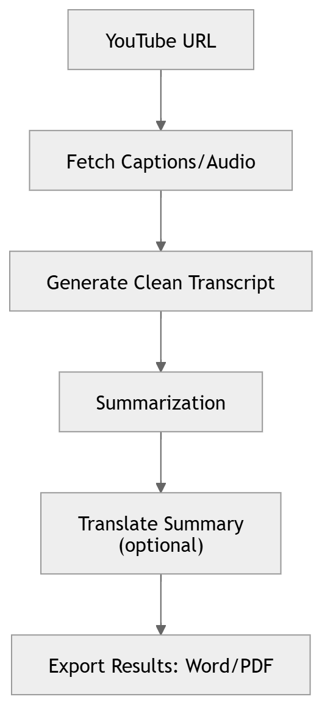

# Insightify 🔍

[](https://www.python.org/)  
[](LICENSE)  
[](https://github.com/yourusername/Insightify)  
[](https://github.com/yourusername/Insightify/issues)  

**Insightify** is a powerful tool that extracts transcripts, summarizes, and translates YouTube videos, allowing you to gain insights quickly and export results in Word or PDF format.  


---

## Table of Contents 📚

- [Features](#features-✨)  
- [How It Works](#how-it-works-🛠️)  
- [Installation](#installation-⚡)  
- [Usage](#usage-🖱️)  
- [Demo](#demo-🎬)  
- [Example](#example)  
- [Contributing](#contributing-🤝)  
- [License](#license-📄)  

---

## Features ✨

* Extract clean transcripts from any YouTube video  
* Generate high-quality summaries  
* Translate summaries into multiple languages  
* Export summaries and transcripts as Word or PDF  
* Smart caching: avoid re-processing videos when updating summaries or translations  

---

## How It Works 🛠️



**Step-by-step workflow:**  

1. Enter a **YouTube URL**  
2. Process video to get **captions/audio**  
3. Generate a **clean transcript**  
4. Create a **summarization**  
5. Optionally **translate** the summary  
6. **Export** results to Word or PDF  

---

## Installation ⚡

```bash
git clone https://github.com/yourusername/Insightify.git
cd Insightify
pip install -r requirements.txt
python app.py
```

---

## Demo  🎥


Here’s a live preview of the app in action:


> Replace `demo.gif` with your actual GIF showing the workflow.

---

## Example

Input YouTube URL: https: //www.youtube.com/watch?v=FU_0NF_jrgE
---

**Output:**  

* Clean Transcript  
* Summary in your chosen language  
* Exportable Word or PDF  

---

## Contributing 🤝

Contributions are welcome! Follow these steps:

1. Fork the repository  
2. Create a new branch (`git checkout -b feature-name`)  
3. Make your changes and commit (`git commit -m "Add feature"`)  
4. Push to the branch (`git push origin feature-name`)  
5. Open a Pull Request  

---

## License 📄

This project is licensed under the **MIT License**.  
See the [LICENSE](LICENSE) file for details.
